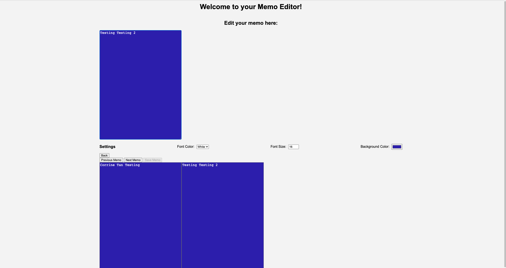

# Welcome to the Memo Editor!

## Instructions to use this webpage:

1. Click "Create Memo" to create your memo.

2. After input your memo into the text editor, please click the "Save Memo" button. You should see an alert showing the message saved successfully.
- Please note that you cannot input more than 200 words.

4. After you click the "Save Memo", you need to click "Next Memo" to create a new one.

5. You can go "Previous Memo" to check old ones and edit them. You will see all the memos listed below.

6. You can go back to main page by clicking "Back".

7. You can open previous memo and edit them using "Open Memo" button.

8. You can use the Settings to change Font Color (Black/White), Font Size or Background. It's globally setting and will set every memos to the same style you choose.

## Enjoy!!!

Website Demo Image | 
:-------------------------:|
  |  